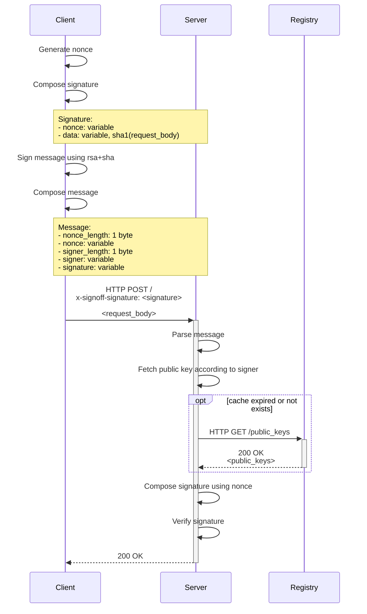

# Lightweight hash-based asymmetric authenticated message mechanism

This implementation aim to avoid MTLS overhead, can be distributed using a public keys registry exposure service.

```mermaid
%%{init: { 'sequence': {'noteAlign': 'left'} }}%%
sequenceDiagram
    participant Client
    participant Server
    participant Registry

    Client->>Client: Generate nonce
    Client->>Client: Compose signature

    Note over Client, Server: Signature:<br />- nonce: variable<br />- data: variable, sha1(request_body)

    Client->>Client: Sign message using rsa+sha

    Client->>Client: Compose message

    Note over Client, Server: Message: <br />- nonce_length: 1 byte<br />- nonce: variable<br />- signer_length: 1 byte<br />- signer: variable<br />- signature: variable

    Client->>+Server: HTTP POST /<br />x-signoff-signature: <signature><br /><br /><request_body>

    Server->>Server: Parse message
    Server->>Server: Fetch public key according to signer

    opt cache expired or not exists
        Server->>+Registry: HTTP GET /public_keys
        Registry-->>-Server: 200 OK<br /><public_keys>
    end

    Server->>Server: Compose signature using nonce
    Server->>Server: Verify signature

    Server-->>-Client: 200 OK

```
